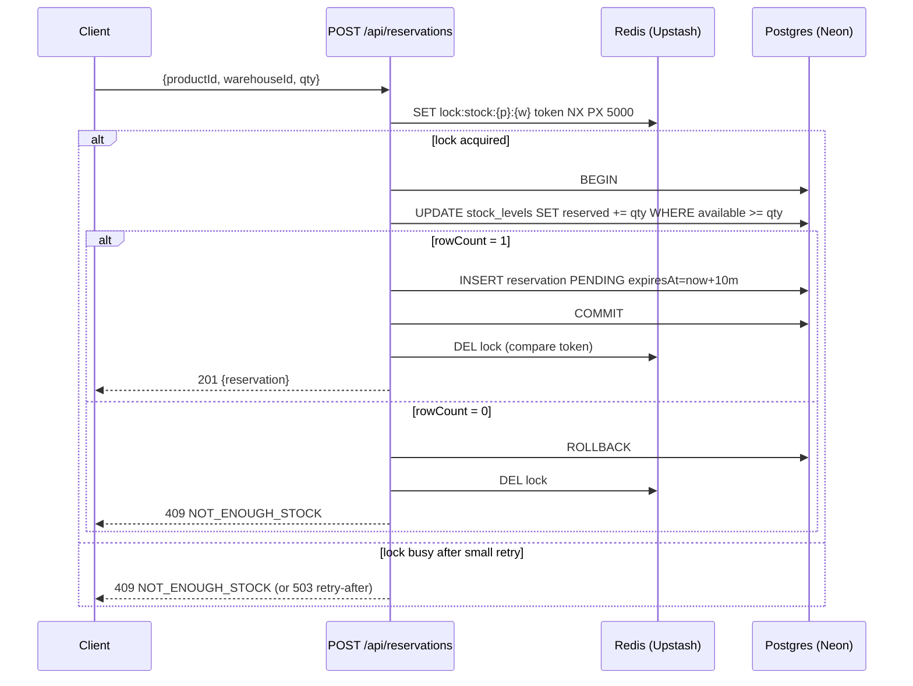

# Allo Reservation Service — Plan

## 1. Stack & hosting

- **Next.js 15** App Router, **TypeScript strict**, **Tailwind + shadcn/ui**.
- **Prisma** + **Neon Postgres** (`DATABASE_URL` = pooled, `DIRECT_URL` = direct for migrations/transactions).
- **Upstash Redis** via `@upstash/redis` (REST — works on Vercel Edge/Node).
- **Zod** shared between API and forms.
- **SWR** for client fetching/polling so the checkout page reflects state without manual refresh.
- **Vitest** for the critical concurrency test.
- Deploy: **Vercel** (app + Cron) + **Neon** + **Upstash**. Free tiers, all wired via env vars in `.env.example`.

## 2. Data model (`prisma/schema.prisma`)

- `Product` — `id`, `sku` (unique), `name`, `description`, `priceCents`.
- `Warehouse` — `id`, `code` (unique), `name`, `region`.
- `StockLevel` — `id`, `productId`, `warehouseId`, `totalUnits`, `reservedUnits`, `updatedAt`. Unique on `(productId, warehouseId)`. `available = totalUnits - reservedUnits` (computed, not stored).
- `Reservation` — `id` (cuid), `productId`, `warehouseId`, `sessionId`, `quantity`, `status` (`PENDING|CONFIRMED|RELEASED|EXPIRED`), `expiresAt`, `createdAt`, `updatedAt`. Indexes on `(status, expiresAt)` for the sweeper and `(sessionId)` for "my reservations".
- No `User` table — anonymous `sessionId` cookie set by middleware. Documented as a trade-off.
- Idempotency lives in Redis (key `idem:{route}:{key}` → `{status, body, requestHash}`, 24h TTL), not in Postgres.

## 3. Concurrency design — the core of the exercise

Defense in depth: **Redis lock is a contention dampener; Postgres atomic UPDATE is the correctness guarantee.** Either alone would be sufficient; together they reduce wasted work under heavy contention and make the README story honest.



Key SQL (run via `prisma.$executeRaw`, inside `prisma.$transaction`):

```sql
UPDATE "StockLevel"
SET "reservedUnits" = "reservedUnits" + $1, "updatedAt" = NOW()
WHERE "productId" = $2 AND "warehouseId" = $3
  AND ("totalUnits" - "reservedUnits") >= $1
```

If `rowCount === 0` → throw `NotEnoughStockError` → 409. This is the line that makes the system race-free; the Redis lock is optimisation, not correctness.

Confirm and cancel use a `SELECT ... FOR UPDATE` on the reservation row inside a transaction, then update both `Reservation.status` and `StockLevel` in one COMMIT:

- **Confirm**: PENDING + not expired → status=CONFIRMED, `totalUnits -= qty`, `reservedUnits -= qty`. If expired → flip to EXPIRED, release reserved units, return 410.
- **Cancel**: PENDING → status=RELEASED, `reservedUnits -= qty`. Idempotent if already RELEASED.

## 4. API surface (all route handlers in `app/api/...`)

- `GET  /api/products` — products with stock per warehouse.
- `POST /api/reservations` — body `{productId, warehouseId, quantity}`. 201 / **409** / 503.
- `GET  /api/reservations/[id]` — also performs lazy expiry check before returning.
- `POST /api/reservations/[id]/confirm` — 200 / 409 / **410**.
- `POST /api/reservations/[id]/cancel` — 200.
- `POST /api/cron/sweep-expired` — guarded by `CRON_SECRET`, runs every minute via `vercel.json` cron.

Reserve and confirm honor `Idempotency-Key` header (bonus, see §7). All errors return shape `{error: {code, message}}` so the UI can branch on `code`.

## 5. Frontend

- `/products` (Server Component) — list with available/reserved counts per warehouse and a "Reserve 1" button (Server Action wrapper that hits the API). On 409, inline error + toast.
- `/reservations/[id]` (Client Component) — fetches reservation via SWR with `refreshInterval: 3000`. Renders:
  - Product + warehouse + quantity.
  - **Live countdown** computed client-side from `expiresAt`, updating every 250ms via `setInterval` (no extra network).
  - **Confirm purchase** and **Cancel** buttons; both call API, then `mutate()` SWR and either route to `/reservations/[id]/done` or update inline.
  - When the countdown hits 0, the page swaps to an "expired" view automatically; the next confirm attempt surfaces 410 from the server (single source of truth).
- 409 and 410 are surfaced as visible banners, never swallowed.

## 6. Expiry mechanism

Two layers, both documented in README:

- **Lazy cleanup** on every read of a reservation: if `status=PENDING` and `expiresAt < now()`, an atomic update flips to `EXPIRED` and releases `reservedUnits`. Cheap and instant.
- **Vercel Cron** at `/api/cron/sweep-expired` every minute: bulk `UPDATE ... WHERE status='PENDING' AND expiresAt < now()` plus the corresponding stock release in a single transaction. Catches reservations no one is looking at.

This combination means even if Cron is delayed, the units are returned the moment any user (or the next reserve attempt on that SKU) touches the system.

## 7. Idempotency (bonus)

- Header: `Idempotency-Key: <uuid>` on reserve and confirm.
- Redis: `idem:{route}:{key}` = `{status, body, requestHashSHA256}` with 24h TTL.
- Flow per request:
  1. If key exists with matching hash → return stored response immediately (no DB work).
  2. If key exists with different hash → 422 `IDEMPOTENCY_KEY_REUSED`.
  3. Otherwise `SET NX` a short-lived in-flight marker, perform the operation, then write the final record and delete the marker. Concurrent retries with the same key block briefly on the marker.

Documented limits in README: TTL-bound (24h), Redis-only (lost on flush — acceptable for a take-home).

## 8. Seeding, tests, deploy

- `prisma/seed.ts`: 2 warehouses (Mumbai, Bangalore), 6 products, stock levels chosen to make demos easy — one SKU with only **1 unit total** in one warehouse so 409 is reproducible live.
- `tests/reservations.concurrent.test.ts`: spin up 50 parallel POSTs against the last unit; assert exactly one `201` and 49 `409`. Run against a Neon branch via `DATABASE_URL` in CI/local.
- Manual demo script in README: open two browser tabs, reserve the 1-unit SKU, watch one succeed and the other 409; watch the countdown; let one expire and see units return.
- High-level commit cadence is detailed in §9 below.

## 9. Trade-offs to call out in README

- No real auth; `sessionId` cookie is the identity. A real system would tie to a user.
- Reservation TTL is 10 minutes, hard-coded. Real systems vary by payment method.
- Idempotency store is Redis-only (TTL-bound). A production version would persist to Postgres for durability.
- Stock decrement on confirm assumes payment is the trigger; in this exercise the "Confirm" button stands in for a payment webhook.
- Redis lock is optional for correctness — Postgres atomic UPDATE alone is sufficient. The lock is kept because the spec hinted at it and it materially reduces wasted DB work under heavy contention.
